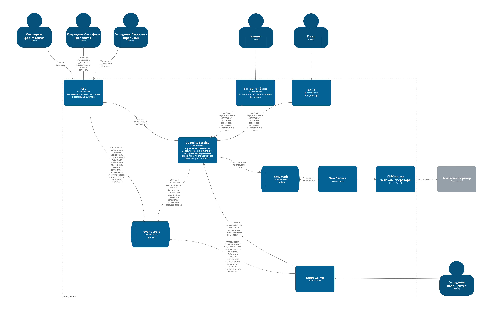
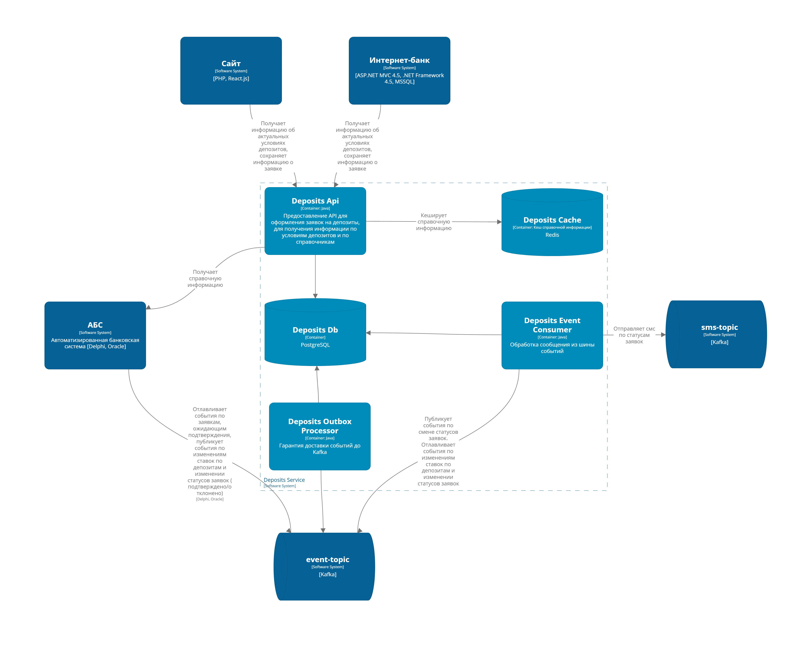

### **Название задачи:** 
### **Автор:** Батова Анастасия
### **Дата:** 2025-04-15
### **Функциональные требования**

| №  | Действующие лица или системы              | Use Case                               | Описание                                                                                                                                                                                                                                                                          |
|----|-------------------------------------------|----------------------------------------|-----------------------------------------------------------------------------------------------------------------------------------------------------------------------------------------------------------------------------------------------------------------------------------|
| 1  | Новый клиент (гость сайта)                | Подача заявки на депозит через сайт     | 1. заходит на сайт и открывает раздел депозитов 2. выбирает подходящий депозит 3. вводит ФИО, номер телефона и сумму 4. нажимает "отправить заявку"                                                                                                                   |
| 2  | Менеджер кол-центра                       | Обработка заявки и звонок               | 1. получает заявку в системе 2. звонит клиенту по указанному номеру 3. озвучивает условия, приглашает в банк на идентификацию 4. подтверждает заявку                                                                                                                  |
| 6  | Авторизованный клиент                     | Клиент оформляет заявку на депозит      | 1. клиент открывает страницу с условиями депозитов 2. система загружает актуальные и персонализированные предложения 3. сайт отображает условия клиенту 4. клиент выбирает депозит и нажимает «оформить» 5. система формирует заявку и отправляет её на обработку |
| 7  | Менеджер бэк-офиса по депозитам           | Менеджер обрабатывает заявку на депозит| 1. получает заявку в АБС 2. проверяет корректность данных клиента 3. сверяет ставку по депозиту 4. подтверждает открытие депозита 5. система отправляет СМС клиенту с подтверждением                                                                              |
| 8  | Сотрудники бэк-офиса депозитов и кредитов | Работа со ставками в АБС               | 1. создают и редактируют данные по депозитам и ставкам 2. сохраняют обновлённые ставки в АБС                                                                                                                                                                                  |

### **Нефункциональные требования**

| №  | Требование                                                                          |
|----|-------------------------------------------------------------------------------------|
| 1  | Дизайн соответствует бренд-буку и дизайн-системе банка                              |
| 2  | Список депозитов загружается < 500 мс при стандартной нагрузке                      |
| 3  | Отклик по операциям в интерфейсе — в пределах 200 мс                                |
| 4  | Возможность независимого деплоя модулей (CI/CD)                                     |
| 5  | Использование существующих СУБД (MS SQL, PostgreSQL, Oracle)                        |
| 6  | Трафик между сервисами и клиентами должен быть зашифрован (HTTPS, TLS)              |
| 7  | Требуется горизонтальное масштабирование, распределение нагрузки между двумя ЦОДами |
| 8  | Трейсы, логи, метрики, алерты — там, где возможно                                   |
| 9  | Все сервисы работают 24/7 с доступностью ≥99,9%                                     |

### **Решение**

#### C4 Model - System Context

#### C4 Model - Containers - Deposits

Системы и сервисы:
* **сайт**: предоставляет информацию о банковских продуктах, предоставляет возможность оставить заявку на депозит потенциальным клиентам банка
* **интернет-банк**: предоставляет возможность проводить платежи, открывать текущие счета, оставлять заявки на депозиты
* **АБС**: ядро банковской системы
* **Deposits**: обрабатывает заявки на открытия депозита, хранит актуальную информацию о ставках и справочниках
* **СМС-шлюз**: перенаправляет информацию телеком-оператору для отправки СМС
* **Колл-центр**: обрабатывает заявки неавторизованных клиентов

#### Описание решения

###### Микросервисная архитектура

- Мы внедряем микросервисную архитектуру для повышения гибкости и масштабируемости системы.
 
  * Гибче управлять командами и ресурсами, снижая зависимость от подрядчиков.
  * В качестве оркестратора выберем Kubernetus: банк планирует активный рост и развитие электронных услуг
  * Стек observability: Prometeus, Grafana, Jaeger, ELK

###### Асинхронное взаимодействие через Kafka
- Для повышения отказоустойчивости добавляем асинхронное взаимодействие между системами через **Kafka**.
- Примеры:
  - Если телеком-оператор недоступен, сообщения о SMS будут храниться в Kafka (`sms-topic`) до восстановления сервиса.
  - Если АБС временно недоступна, сайт продолжит принимать заявки на депозиты, а сотрудники бэк-офиса обработают их позже.

###### Новый микросервис Deposits

Выделяем функционал работы с заявками на депозиты в отдельный микросервис **Deposits**. 
Это позволит:
  - Разрабатывать новый функционал независимо от устаревшего монолита интернет-банка
  - Использовать современные технологии
  - В качестве стека предлагается использовать: Java, PostgreSQL, Redis
    - `Java`: есть свои эксперты в технологии, большое количество специалистов на рынке, активное сообщество 
    - `PostgreSQL`: активно развивается, не нужно приобретать лицензии для использования. Минусы: не так удобен и развит как MSSQL, менее удобные инструменты
    - `Redis`: универсален, распространен, современен, знаком многим инженерам, поддерживает кластеризацию и асинхронную репликацию

###### Кеширование данных в Redis
 
Внедряем `Redis` для кеширования справочной информации в микросервисе Deposits.
Преимущества:
  - Снижается нагрузка на базу данных АБС.
  - Ускоряется отклик системы для клиентов интернет-банка.

###### Горизонтальное масштабирование

- В каждом ЦОДе поднимаем инстансы всех основных компонентов.
- Добавляем балансировщики для распределения запросов между ЦОДами.
- `Kubernetes`: выбираем единый кластер Kubernetes, так как команда пока не имеет достаточной экспертизы для управления несколькими кластерами. Единый кластер проще поддерживать и настраивать, особенно на этапе MVP.
- **MSSQL (интернет-банк):**
  - Настроим репликацию master-replica.
  - Для простоты на этапе MVP будем читать данные только с мастера, чтобы избежать проблем с отставанием реплики.
- **PostgreSQL (микросервис Deposits):**
  - Настроим репликацию master-replica.
  - Для справочных данных и данных, которые редко меняются, будем читать как с мастера, так и с реплики.
  - Для данных по заявкам на депозиты будем читать только с мастера, чтобы избежать проблем с отставанием реплики (на этапе MVP).
- **Oracle (АБС):**
  - Поднимем резервную БД Oracle, которая будет копией основной БД.
  - Для MVP мы продолжим читать с основной БД, со временем будем постепенно переводить часть операций на чтение на резервную БД.
- **Redis:**
  - Настраиваем асинхронную репликацию Redis на другой ЦОД
- **Kafka:**
  - Размещаем 6 брокеров: 2 в первом ЦОДе, 2 во втором и 2 в резервном ЦОДе. Такая конфигурация гарантирует достижение кворума даже при сбое одного из ЦОДов.

###### Наблюдаемость системы
- Для мониторинга и анализа производительности внедряем следующие инструменты:
  - **Prometheus**: Сбор метрик.
  - **Grafana**: Визуализация данных.
  - **Jaeger**: Трассировка запросов.
  - **ELK Stack**: Логирование и анализ ошибок.

### **Альтернативы**

###### Доработка внутри интернет-банка вместо выделения отдельного микросервиса Deposits
Вместо выделения микросервиса Deposits можно было бы продолжить развивать функционал внутри существующего монолита интернет-банка
 
Преимущества:
  * Проще в реализации и поддержке на начальном этапе.
  * Нет необходимости в сложных механизмах взаимодействия между сервисами (например, через Kafka).
  * Не требуется обучение команд новым технологиям (Kubernetes, Docker, микросервисы).

Недостатки:
  * Ограниченная гибкость: разработка новых функций зависит от монолита и его устаревших технологий. 
  * Высокая зависимость от подрядчиков, поддерживающих монолит.

###### Использование только синхронного взаимодействия вместо асинхронного

Вместо асинхронного взаимодействия через Kafka можно было бы использовать только синхронные вызовы между системами (например, REST API или SOAP).
   
**Преимущества:**
   * Проще в реализации и отладке.
   * Нет необходимости в дополнительных компонентах (например, Kafka или Outbox Processor).
   * Более понятный процесс обработки данных для команды.
**Недостатки:**   
   * Низкая отказоустойчивость: если одна из систем недоступна, вся цепочка взаимодействия останавливается.
   * Выше задержки при работе с внешними системами (например, телеком-оператором).
   * Сложнее масштабировать и адаптировать под высокие нагрузки.

### Недостатки, ограничения, риски выбранного решения

* Увеличение стоимости инфраструктуры и затрат на поддержку
* Необходимость обучить команды незнакомым технологиям (Kafka, Redis, Kubernetus, Observability)
* Развертывание систем в двух ЦОДах создает зависимость от стабильности и скорости междатацентрового канала
* Риск потери доступности системы в случае недоступности одного из ЦОДов, если механизмы отказоустойчивости не настроены должным образом
* Ошибки в конфигурации Kubernetes (например, неправильное распределение ресурсов или настройка сетевых политик) могут привести к сбоям в работе микросервисов
* Если мониторинг и логирование настроены некорректно, команда может не заметить проблемы до того, как они повлияют на пользователей
* Реализация всех компонентов решения может занять больше времени, чем запланировано, особенно если команда сталкивается с трудностями при внедрении новых технологий
* Ограничения по времени могут привести к тому, что часть функционала будет реализована не полностью или с минимальной функциональностью, что повлияет на качество MVP
* Риск недооценки сложности интеграции между старыми и новыми системами

