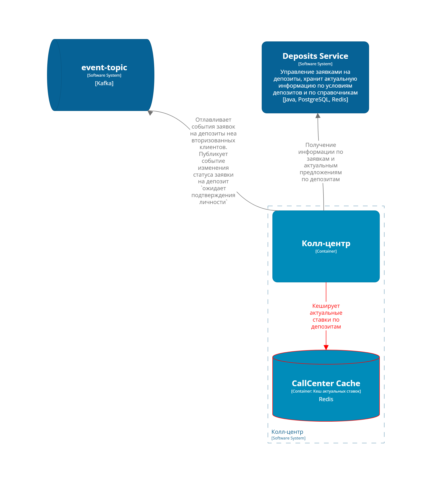

### **Название задачи:** Передача ставок в кол-центр
### **Автор:** Батова Анастасия
### **Дата:** 2025-04-20
### **Функциональные требования**

| № | Действующие лица или системы              | Use Case                               | Описание                                                                                                                                                                                                                                                                          |
|---|-------------------------------------------|----------------------------------------|-----------------------------------------------------------------------------------------------------------------------------------------------------------------------------------------------------------------------------------------------------------------------------------|
| 1 | Сотрудник внутреннего кол-центра          | Просмотр актуальных ставок              | 1. сотрудник заходит в систему кол-центра 2. система запрашивает актуальные ставки из микросервиса `Deposits Service` 3. система отображает актуальные ставки сотруднику 4. сотрудник использует данные для консультации клиентов                                          |
| 2 | Система банка                             | Передача ставок в партнёрский кол-центр | 1. микросервис `Deposits Service` генерирует файл с актуальными ставками 2. файл передается на SFTP-сервер партнёрского кол-центра 3. партнёрский кол-центр загружает файл и использует данные для консультаций                                                          |
| 3 | Сотрудник партнёрского кол-центра         | Консультация клиентов                   | 1. сотрудник получает доступ к актуальным ставкам через свою систему 2. клиент звонит в кол-центр 3. сотрудник использует загруженные данные для ответов на вопросы клиента                                                                                                |

### **Нефункциональные требования**

|**№**| **Требование**                                                                                                                                                                               |
| :-: |:---------------------------------------------------------------------------------------------------------------------------------------------------------------------------------------------|
|1| Доступ к ставкам должен быть ограничен только авторизованными пользователями (сотрудниками кол-центра)                                                                                       |
|2| Передача файлов через SFTP должна осуществляться с использованием шифрования                                                                                                                 |
|3| Система должна быть доступна 99.9% времени для внутреннего кол-центра                                                                                                                        |
|4| Система должна обеспечивать доступ к актуальным ставкам для сотрудников кол-центра с задержкой не более 0,5 секунды                                                                          |
|5| Файлы с актуальными ставками должны передаваться в партнёрский кол-центр в течение 5 минут после обновления данных                                                                           |
|6| Система должна поддерживать обработку до 100 запросов в секунду для внутреннего кол-центра                                                                                                   |
|7| При недоступности микросервиса Deposits Service сотрудники кол-центра должны иметь доступ к последним актуальным данным из кеша (Redis)                                                      |
|8| Ставки, отображаемые в системе внутреннего кол-центра, должны быть согласованы с данными партнёрского кол-центра. Максимальное отставание ставок между двумя кол-центрами не более 10 минут |
|9| При сбое система должна отправлять уведомления администраторам                                                                                                                               |
|10| Необходимо настроить мониторинг (Prometheus, Grafana) для отслеживания производительности микросервиса Deposits Service и состояния передачи файлов                                          |

### **Решение**

#### C4 Model - System Context

#### C4 Model - Containers - CallCenter

#### Описание решения

###### Актуальные ставки для кол-центра

Система основного кол-центра будет периодически запрашивать актуальные ставки, кэшируя их с временем жизни (TTL) в 5 минут.  

Это решение обеспечивает:

- Быструю доступность свежей информации для операторов;
- Снижение нагрузки на микросервис `Deposits` при массовых обращениях клиентов.

Для повышения отказоустойчивости необходимо, чтобы система кол-центра хранила локальную копию последней успешно полученной версии ставок.  
Это позволит продолжать консультирование клиентов даже в случае временной недоступности кэша или микросервиса `Deposits`.

###### Актуальные ставки для партнерского кол-центра

Микросервис `Deposits` при наступлении события изменения ставок в АБС, будет формировать файл для партнерского центра и сохранять его на сервере.

Такой механизм позволит быстро передавать обновлённые ставки.

### **Альтернативы**

###### Формирование файла фоновым процессом 1 раз в сутки

Можно было бы формировать файл фоновым процессом и отправлять партнерскому кол-центру. 

**Преимущества:**
* Простота реализации и минимальная нагрузка на инфраструктуру

**Минусы:** 
* В случае обнаружения ошибки в ставках в течение дня оперативное обновление данных будет невозможно.
* Ставки кол-центра и партнерского кол-центра должны быть одинаковыми, а значит информация кол-центра тоже должна обновляться 1 раз в день. 

###### Асинхронное обновление информации о ставках в кол-центре

Альтернативным подходом могла бы стать подписка кол-центра на событие изменения ставок с последующей немедленной актуализацией данных.

**Преимущества:**
- Кол-центр оперативно получал бы обновления ставок практически без задержек.
- Не было бы необходимости часто опрашивать систему о новых ставках (например, каждые 5 минут).

**Недостатки:**

В реализации такого варианта существуют два направления:

1. Подписка на событие изменения ставок в АБС: 
  * Необходимо, чтобы кол-центр обращался за актуальными ставками в АБС, иначе есть риск обработать событие раньше, чем обновит свои ставки deposits.
  * АБС и так уже сильно нагружена и прямые вызовы к ней нежелательны.
  * Лучше иметь единую точку в системе, которая будет ответственна за распределение информации о актуальных ставках по платформе: deposits. 

2. Подписка на событие изменения ставок в `deposits`:
  * Потребует, чтобы `Deposits` самостоятельно генерировал событие при обновлении своей копии ставок.
  * Это приведёт к появлению двух типов событий — изменение ставки от АБС и изменение ставки от `Deposits`, что сделает логику обработки менее прозрачной и повысит риск ошибок со стороны инженеров при выборе нужного события в будущем. Возможно, в будущем нам без этого не обойтись будет, но тогда необходимо продумать как исключить путаницу.

**Недостатки, ограничения, риски**

- Обновление ставок происходит с небольшим лагом между фактическим изменением данных в АБС и формированием файла в микросервисе `Deposits`.
- Если сервер, предоставленный партнером будет недоступен, мы не сможем сохранить файл. И данные по ставкам между двумя кол-центрами будут расходится.
- Кэширование ставок в системе кол-центра с TTL в 5 минут накладывает ограничение на минимальную задержку обновления данных.
- При недоступности микросервиса `Deposits` или нарушении работы кэширования операторы кол-центра будут видеть устаревшие ставки.
- Ошибки в работе локального хранения ставок могут привести к консультированию клиентов на основе неактуальной информации.